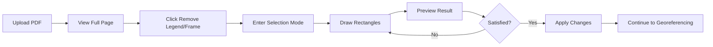

# Legend/Frame Removal Implementation Plan

## Overview
This document outlines the implementation plan for a manual selection tool that allows users to remove legends, frames, and other unwanted elements from PDF maps before georeferencing.

## Problem Statement
PDF maps often contain:
- Legend boxes with symbols and text
- Title frames and headers
- Scale bars and coordinate grids
- Copyright notices and metadata
- Decorative borders

These elements interfere with georeferencing and need to be removed while preserving the actual map content.

## Solution Approach
Implement a manual selection tool that allows users to:
1. Draw rectangles around areas to keep or remove
2. Preview the result before applying
3. Process the cleaned image for georeferencing

---

## Phase 1: UI Design & User Flow

### User Journey


### UI Layout
```
┌─────────────────────────────────────────────┐
│ [Upload PDF] [Remove Legend] [Clear] [Help] │  <- Main Toolbar
├─────────────────────────────────────────────┤
│                                             │
│          PDF Display Area                   │
│        (with selection overlay)             │
│                                             │
├─────────────────────────────────────────────┤
│ Selection Mode: [Remove Areas] [Keep Areas] │  <- Mode Toggle
│ [Preview] [Undo] [Clear All] [Apply]       │  <- Action Buttons
└─────────────────────────────────────────────┘
```

---

## Phase 2: Technical Implementation

### Core Data Structure
```javascript
const selectionState = {
    isSelecting: false,
    mode: 'remove', // 'keep' or 'remove'
    rectangles: [],
    currentRect: null,
    canvas: null,
    ctx: null,
    originalImage: null,
    processedImage: null
};

// Rectangle object structure
const rectangle = {
    startX: 0,
    startY: 0,
    endX: 0,
    endY: 0,
    mode: 'remove', // or 'keep'
    id: 'rect_1234567890'
};
```

### Step 1: Canvas Overlay Setup
```javascript
function createSelectionCanvas() {
    const canvas = document.createElement('canvas');
    canvas.className = 'selection-canvas';
    canvas.style.position = 'absolute';
    canvas.style.top = '0';
    canvas.style.left = '0';
    canvas.style.pointerEvents = 'auto';
    canvas.style.zIndex = '20';
    canvas.style.cursor = 'crosshair';
    
    // Match PDF container size
    const pdfContainer = document.querySelector('.pdf-container');
    canvas.width = pdfContainer.offsetWidth;
    canvas.height = pdfContainer.offsetHeight;
    
    return canvas;
}
```

### Step 2: Mouse Event Handling
```javascript
// Convert mouse position to canvas coordinates
function getMousePos(e, canvas) {
    const rect = canvas.getBoundingClientRect();
    return {
        x: e.clientX - rect.left,
        y: e.clientY - rect.top
    };
}

// Start drawing rectangle
function handleMouseDown(e) {
    if (!selectionState.isSelecting) return;
    
    const pos = getMousePos(e, selectionState.canvas);
    selectionState.currentRect = {
        startX: pos.x,
        startY: pos.y,
        endX: pos.x,
        endY: pos.y,
        mode: selectionState.mode,
        id: `rect_${Date.now()}`
    };
}

// Update rectangle while dragging
function handleMouseMove(e) {
    if (!selectionState.currentRect) return;
    
    const pos = getMousePos(e, selectionState.canvas);
    selectionState.currentRect.endX = pos.x;
    selectionState.currentRect.endY = pos.y;
    
    redrawCanvas();
}

// Finish drawing rectangle
function handleMouseUp() {
    if (!selectionState.currentRect) return;
    
    // Normalize rectangle (handle negative dimensions)
    const rect = normalizeRectangle(selectionState.currentRect);
    
    // Only add if rectangle has area
    if (rect.width > 5 && rect.height > 5) {
        selectionState.rectangles.push(rect);
    }
    
    selectionState.currentRect = null;
    redrawCanvas();
}
```

### Step 3: Visual Rendering
```javascript
const SELECTION_STYLES = {
    keep: {
        fill: 'rgba(0, 255, 0, 0.2)',
        stroke: '#00ff00',
        lineWidth: 2,
        lineDash: [5, 5]
    },
    remove: {
        fill: 'rgba(255, 0, 0, 0.2)',
        stroke: '#ff0000',
        lineWidth: 2,
        lineDash: []
    },
    current: {
        fill: 'rgba(0, 123, 255, 0.1)',
        stroke: '#007bff',
        lineWidth: 2,
        lineDash: [10, 5]
    }
};

function redrawCanvas() {
    const ctx = selectionState.ctx;
    ctx.clearRect(0, 0, selectionState.canvas.width, selectionState.canvas.height);
    
    // Draw existing rectangles
    selectionState.rectangles.forEach(rect => {
        drawRectangle(ctx, rect, SELECTION_STYLES[rect.mode]);
    });
    
    // Draw current rectangle being drawn
    if (selectionState.currentRect) {
        drawRectangle(ctx, selectionState.currentRect, SELECTION_STYLES.current);
    }
}

function drawRectangle(ctx, rect, style) {
    ctx.fillStyle = style.fill;
    ctx.strokeStyle = style.stroke;
    ctx.lineWidth = style.lineWidth;
    ctx.setLineDash(style.lineDash || []);
    
    const x = Math.min(rect.startX, rect.endX);
    const y = Math.min(rect.startY, rect.endY);
    const width = Math.abs(rect.endX - rect.startX);
    const height = Math.abs(rect.endY - rect.startY);
    
    ctx.fillRect(x, y, width, height);
    ctx.strokeRect(x, y, width, height);
}
```

### Step 4: Image Processing
```javascript
async function applySelections() {
    const pdfImage = document.querySelector('.pdf-image');
    const processCanvas = document.createElement('canvas');
    const processCtx = processCanvas.getContext('2d');
    
    // Set canvas size to match original image
    processCanvas.width = pdfImage.naturalWidth;
    processCanvas.height = pdfImage.naturalHeight;
    
    // Calculate scale factor between display and actual size
    const scaleX = pdfImage.naturalWidth / pdfImage.width;
    const scaleY = pdfImage.naturalHeight / pdfImage.height;
    
    if (selectionState.mode === 'keep') {
        // White background
        processCtx.fillStyle = 'white';
        processCtx.fillRect(0, 0, processCanvas.width, processCanvas.height);
        
        // Draw only kept areas
        selectionState.rectangles.forEach(rect => {
            if (rect.mode === 'keep') {
                const sx = rect.startX * scaleX;
                const sy = rect.startY * scaleY;
                const sw = (rect.endX - rect.startX) * scaleX;
                const sh = (rect.endY - rect.startY) * scaleY;
                
                processCtx.drawImage(pdfImage, 
                    sx, sy, sw, sh,  // Source rectangle
                    sx, sy, sw, sh   // Destination rectangle
                );
            }
        });
    } else {
        // Draw full image
        processCtx.drawImage(pdfImage, 0, 0);
        
        // Remove selected areas
        processCtx.fillStyle = 'white';
        selectionState.rectangles.forEach(rect => {
            if (rect.mode === 'remove') {
                const x = Math.min(rect.startX, rect.endX) * scaleX;
                const y = Math.min(rect.startY, rect.endY) * scaleY;
                const width = Math.abs(rect.endX - rect.startX) * scaleX;
                const height = Math.abs(rect.endY - rect.startY) * scaleY;
                
                processCtx.fillRect(x, y, width, height);
            }
        });
    }
    
    return processCanvas.toDataURL('image/png');
}
```

---

## Phase 3: UI Components

### CSS Styles
```css
/* Selection mode toolbar */
.selection-toolbar {
    position: absolute;
    top: 70px;
    left: 20px;
    right: 20px;
    background: white;
    padding: 15px;
    border-radius: 8px;
    box-shadow: 0 2px 10px rgba(0,0,0,0.1);
    z-index: 15;
    display: none;
}

.selection-toolbar.active {
    display: block;
}

/* Mode selector */
.mode-selector {
    display: inline-flex;
    gap: 10px;
    margin-right: 20px;
}

.mode-button {
    padding: 8px 16px;
    border: 2px solid #e5e7eb;
    background: white;
    cursor: pointer;
    border-radius: 6px;
    transition: all 0.2s;
}

.mode-button:hover {
    border-color: #3b82f6;
}

.mode-button.active {
    background: #3b82f6;
    color: white;
    border-color: #3b82f6;
}

/* Action buttons */
.selection-actions {
    display: inline-flex;
    gap: 10px;
}

.action-button {
    padding: 8px 16px;
    border: none;
    border-radius: 6px;
    cursor: pointer;
    font-size: 14px;
    transition: all 0.2s;
}

.preview-btn {
    background: #6b7280;
    color: white;
}

.undo-btn {
    background: #f59e0b;
    color: white;
}

.clear-btn {
    background: #ef4444;
    color: white;
}

.apply-btn {
    background: #10b981;
    color: white;
}

/* Selection canvas */
.selection-canvas {
    cursor: crosshair;
}

/* Preview mode */
.preview-overlay {
    position: absolute;
    top: 0;
    left: 0;
    width: 100%;
    height: 100%;
    z-index: 25;
    display: none;
}

.preview-overlay img {
    width: 100%;
    height: 100%;
    object-fit: contain;
}

/* Instructions */
.selection-instructions {
    position: absolute;
    bottom: 60px;
    left: 50%;
    transform: translateX(-50%);
    background: rgba(0,0,0,0.8);
    color: white;
    padding: 10px 20px;
    border-radius: 20px;
    font-size: 14px;
    z-index: 30;
}
```

### HTML Structure
```html
<!-- Add to existing controls -->
<button class="legend-remove-btn" style="display: none;">
    Remove Legend/Frame
</button>

<!-- Selection mode toolbar -->
<div class="selection-toolbar">
    <div class="toolbar-content">
        <div class="mode-selector">
            <span>Mode:</span>
            <button class="mode-button active" data-mode="remove">
                Remove Areas
            </button>
            <button class="mode-button" data-mode="keep">
                Keep Areas Only
            </button>
        </div>
        
        <div class="selection-actions">
            <button class="action-button preview-btn">
                Preview
            </button>
            <button class="action-button undo-btn">
                Undo Last
            </button>
            <button class="action-button clear-btn">
                Clear All
            </button>
            <button class="action-button apply-btn">
                Apply & Continue
            </button>
        </div>
    </div>
</div>

<!-- Selection instructions -->
<div class="selection-instructions" style="display: none;">
    Draw rectangles around areas to remove
</div>

<!-- Preview overlay -->
<div class="preview-overlay">
    
</div>
```

---

## Phase 4: Integration

### Entry/Exit Functions
```javascript
function enterSelectionMode() {
    // Store original state
    selectionState.originalImage = document.querySelector('.pdf-image').src;
    
    // Create selection canvas
    const container = document.querySelector('.pdf-container');
    selectionState.canvas = createSelectionCanvas();
    selectionState.ctx = selectionState.canvas.getContext('2d');
    container.appendChild(selectionState.canvas);
    
    // Attach event listeners
    selectionState.canvas.addEventListener('mousedown', handleMouseDown);
    selectionState.canvas.addEventListener('mousemove', handleMouseMove);
    selectionState.canvas.addEventListener('mouseup', handleMouseUp);
    selectionState.canvas.addEventListener('mouseleave', handleMouseUp);
    
    // Show UI elements
    document.querySelector('.selection-toolbar').classList.add('active');
    document.querySelector('.selection-instructions').style.display = 'block';
    
    // Set state
    selectionState.isSelecting = true;
    
    // Update status
    updateStatus('Selection mode active - draw rectangles to select areas');
}

function exitSelectionMode(applyChanges = false) {
    // Remove canvas
    if (selectionState.canvas) {
        selectionState.canvas.remove();
    }
    
    // Hide UI elements
    document.querySelector('.selection-toolbar').classList.remove('active');
    document.querySelector('.selection-instructions').style.display = 'none';
    
    // Apply or revert changes
    if (applyChanges && selectionState.processedImage) {
        document.querySelector('.pdf-image').src = selectionState.processedImage;
    } else {
        document.querySelector('.pdf-image').src = selectionState.originalImage;
    }
    
    // Reset state
    selectionState.isSelecting = false;
    selectionState.rectangles = [];
    selectionState.currentRect = null;
    
    // Update UI
    if (applyChanges) {
        document.querySelector('.start-georef-btn').style.display = 'inline-block';
        updateStatus('Legend/frame removed - ready for georeferencing');
    }
}
```

### Button Event Handlers
```javascript
// Mode switching
document.querySelectorAll('.mode-button').forEach(btn => {
    btn.addEventListener('click', (e) => {
        document.querySelectorAll('.mode-button').forEach(b => 
            b.classList.remove('active')
        );
        e.target.classList.add('active');
        selectionState.mode = e.target.dataset.mode;
        
        // Update instructions
        const instruction = selectionState.mode === 'keep' 
            ? 'Draw rectangles around areas to keep'
            : 'Draw rectangles around areas to remove';
        document.querySelector('.selection-instructions').textContent = instruction;
    });
});

// Preview button
document.querySelector('.preview-btn').addEventListener('click', async () => {
    const processed = await applySelections();
    const previewImg = document.querySelector('.preview-image');
    previewImg.src = processed;
    document.querySelector('.preview-overlay').style.display = 'block';
    
    // Hide after 3 seconds
    setTimeout(() => {
        document.querySelector('.preview-overlay').style.display = 'none';
    }, 3000);
});

// Undo button
document.querySelector('.undo-btn').addEventListener('click', () => {
    selectionState.rectangles.pop();
    redrawCanvas();
});

// Clear button
document.querySelector('.clear-btn').addEventListener('click', () => {
    selectionState.rectangles = [];
    redrawCanvas();
});

// Apply button
document.querySelector('.apply-btn').addEventListener('click', async () => {
    selectionState.processedImage = await applySelections();
    exitSelectionMode(true);
});
```

---

## Phase 5: Advanced Features

### 1. Rectangle Editing
```javascript
// Add resize handles to selected rectangles
function addResizeHandles(rect) {
    const handles = [
        { position: 'nw', cursor: 'nw-resize' },
        { position: 'ne', cursor: 'ne-resize' },
        { position: 'sw', cursor: 'sw-resize' },
        { position: 'se', cursor: 'se-resize' },
        { position: 'n', cursor: 'n-resize' },
        { position: 's', cursor: 's-resize' },
        { position: 'e', cursor: 'e-resize' },
        { position: 'w', cursor: 'w-resize' }
    ];
    
    return handles;
}
```

### 2. Keyboard Shortcuts
```javascript
document.addEventListener('keydown', (e) => {
    if (!selectionState.isSelecting) return;
    
    switch(e.key) {
        case 'Escape':
            exitSelectionMode(false);
            break;
        case 'Enter':
            applySelections();
            break;
        case 'z':
            if (e.ctrlKey || e.metaKey) {
                // Undo
                selectionState.rectangles.pop();
                redrawCanvas();
            }
            break;
        case 'Delete':
            // Delete selected rectangle
            if (selectionState.selectedRect) {
                removeRectangle(selectionState.selectedRect.id);
            }
            break;
    }
});
```

### 3. Smart Selection Helpers
```javascript
// Snap to edges
function snapToEdges(point, threshold = 10) {
    const edges = detectEdges();
    let snappedPoint = { ...point };
    
    edges.forEach(edge => {
        if (Math.abs(point.x - edge.x) < threshold) {
            snappedPoint.x = edge.x;
        }
        if (Math.abs(point.y - edge.y) < threshold) {
            snappedPoint.y = edge.y;
        }
    });
    
    return snappedPoint;
}

// Magnetic guides
function showAlignmentGuides(rect) {
    const guides = findAlignmentGuides(rect);
    drawGuides(guides);
}
```

---

## Phase 6: Error Handling & Edge Cases

### Error Scenarios
1. **Empty selection** - Show warning if no rectangles drawn
2. **Overlapping rectangles** - Merge or handle conflicts
3. **Invalid dimensions** - Minimum size requirements
4. **Performance issues** - Large PDF handling
5. **Browser compatibility** - Canvas API support

### Validation
```javascript
function validateSelections() {
    if (selectionState.rectangles.length === 0) {
        alert('Please draw at least one selection rectangle');
        return false;
    }
    
    // Check for complete coverage in 'keep' mode
    if (selectionState.mode === 'keep') {
        const coverage = calculateCoverage();
        if (coverage < 0.1) {
            alert('Selected area too small. Please select more of the map.');
            return false;
        }
    }
    
    return true;
}
```

---

## Phase 7: Testing Plan

### Unit Tests
- Rectangle drawing calculations
- Coordinate transformations
- Image processing logic
- State management

### Integration Tests
- Full workflow from PDF upload to processed output
- Mode switching behavior
- Preview functionality
- Undo/redo operations

### User Testing Scenarios
1. Simple rectangular legend removal
2. Multiple disconnected areas
3. Complex frame with multiple elements
4. Keep only map area (inverse selection)
5. Performance with large PDFs

---

## Implementation Timeline

### Week 1: Core Functionality
- **Day 1-2**: Canvas setup and basic rectangle drawing
- **Day 3-4**: Image processing and application logic
- **Day 5**: UI integration and basic controls

### Week 2: Polish & Enhancement
- **Day 1-2**: Preview functionality and visual feedback
- **Day 3**: Keyboard shortcuts and helpers
- **Day 4**: Error handling and validation
- **Day 5**: Testing and bug fixes

---

## Future Enhancements

### Near Term
1. **Polygon selection** - Free-form shapes beyond rectangles
2. **Magic wand tool** - Select areas by color similarity
3. **Template system** - Save and reuse selection patterns
4. **Batch processing** - Apply same selection to multiple PDFs

### Long Term
1. **AI-powered detection** - Automatically identify legends
2. **OCR integration** - Detect text regions for removal
3. **Cloud processing** - Server-side processing for better performance
4. **Plugin architecture** - Extensible selection tools

---

## Conclusion

This implementation plan provides a comprehensive approach to manual legend/frame removal with room for future enhancements. The modular design allows for incremental development while maintaining a solid foundation for more advanced features.